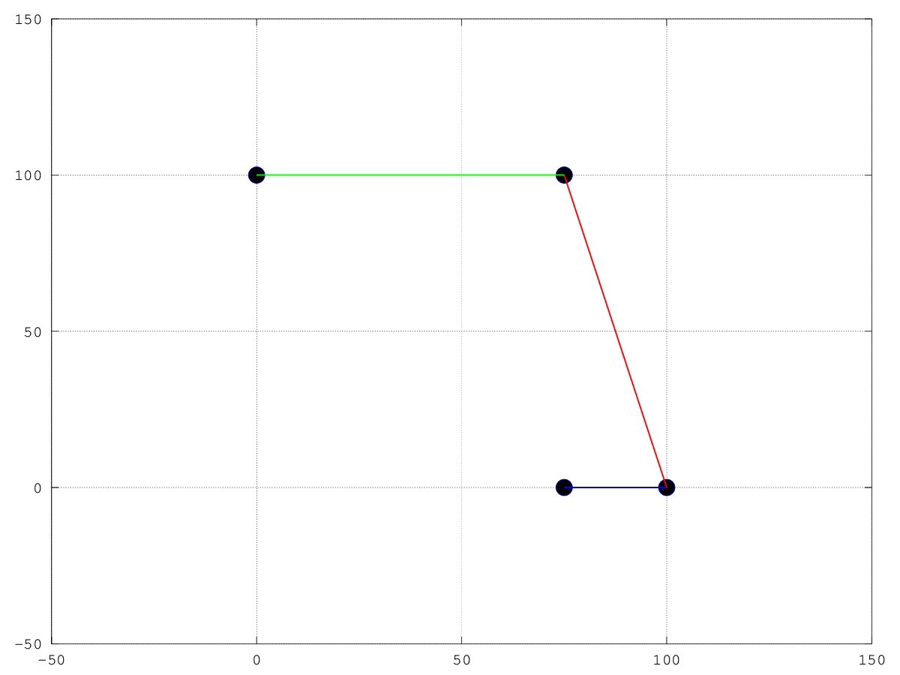
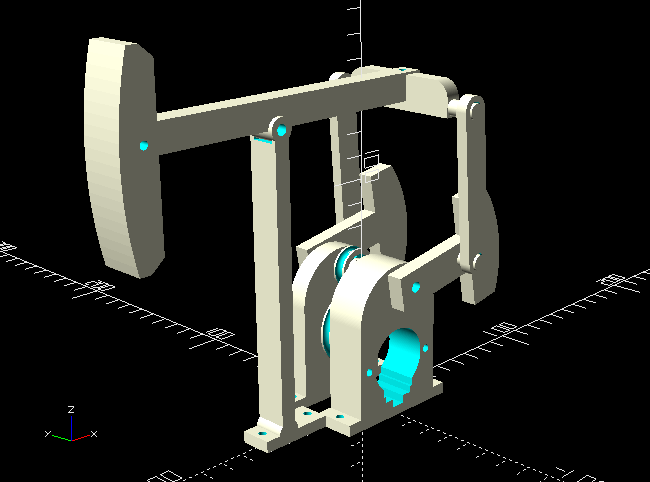

# Animated scale pumpjack

I had (and still have) no knowledge nor experience in mechanical design but I always wanted to make a completely parametric model in OpenSCAD. For this project, I designed all the parts of a scale model of a pumpjack, to be 3D-printed and driven by a 5V stepper motor. Its only purpose is to shake a tea bag and make a cool desktop gadget.  

To control the stepper motor position and speed, I designed a four-step sequencer that uses a two-bit counter based on JK master-slave flip-flops (74HC109) and an AND-gate based decoder (74HC08). An ULN2003 based driver (not displayed in the schematics) was used to amplify the output current of the sequencer.  

  

This circuit was implemented on a perfboard. I should, and in fact I started doing the design in Kicad, but for agility reasons, I did it in Proteus.  

  

An Octave simulation was used to define and calculate all of the system dimensions. The script can be extended to perform a simple structural analysis, and to optimize the design in many ways.  

  

I'm still printing the parts, but it will look like this:

  