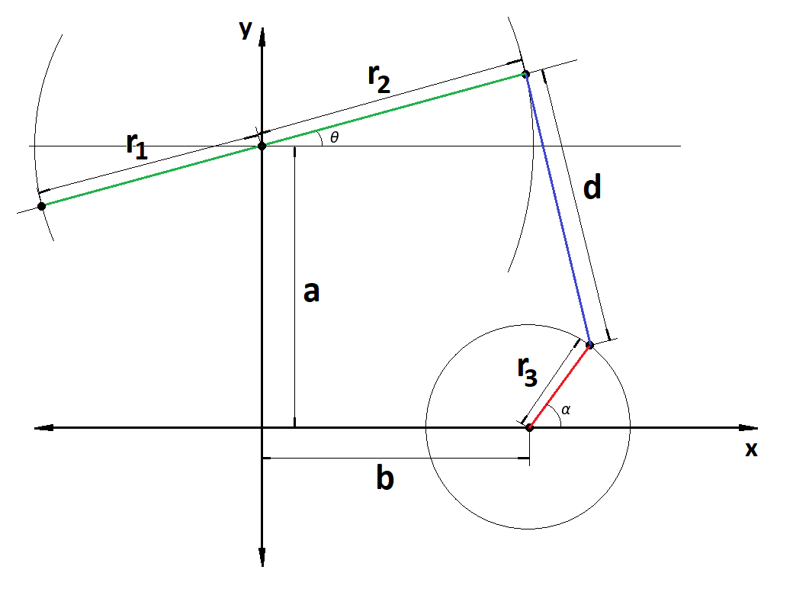
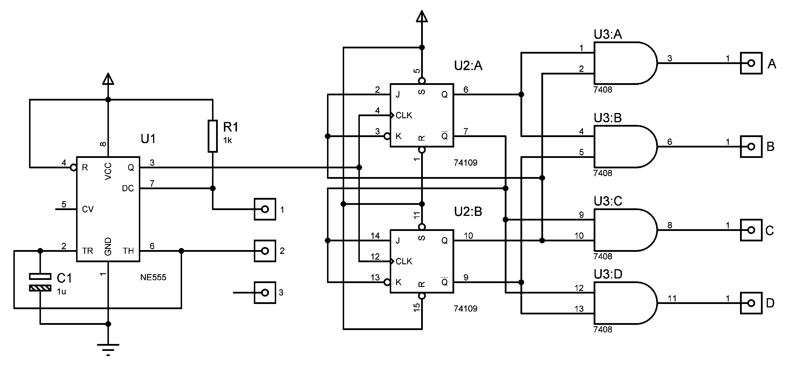
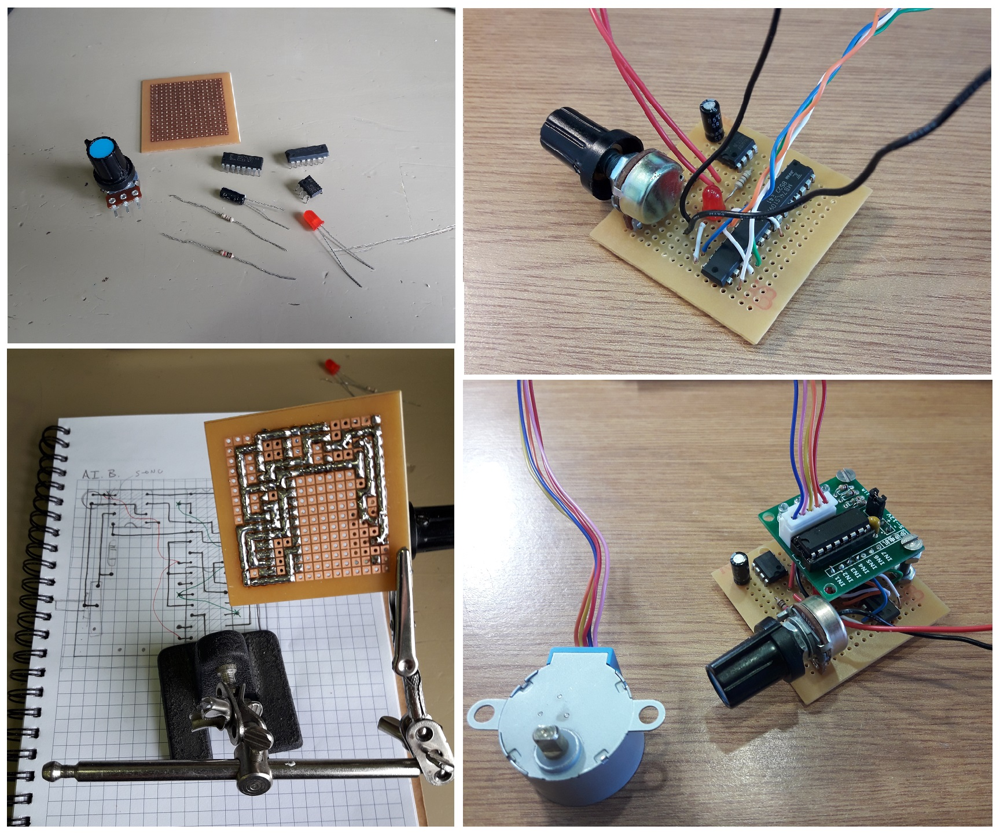

# Parametric 3D model of an oil pumpjack

This is a Code-CAD based project that consists on the parametric modeling of all the parts of a scale oil pumpjack to be 3D-printed and driven by a 5V stepper motor. 

  

## Parameters of the model

This design is not based on any real model. Some basic parameters were selected to define the mechanical system dimensions:

  

An Octave simulation was used to test the resulting behavior of the machine depending on the selected parameters. The script was intended to optimize the design and can be extended to perform a structural or performance analysis.  

  

## Electronics 

To control the stepper motor position and speed, it is provided the design of a four-step sequencer that uses a two-bit counter based on JK master-slave flip-flops (74HC109) and an AND-gate based decoder (74HC08). A ULN2003 based driver (not displayed in the schematics) was used to amplify the output current of the sequencer.  

  

This circuit was implemented on a perfboard. A CAD PCB design is also provided which follows the perfboard layout, however, its recommended to modify it to build a better PCB in order to achieve a more professional result.

  

### Additional materials

  - 13 bolts M2.5 x 25mm  
  - 17 nuts M2.5  
  - 1 bolt M5 x 65 mm  
  - 5 nuts M5  
  - 4 thumbtacks  
  - 1 150x90x20 mm wood plank  